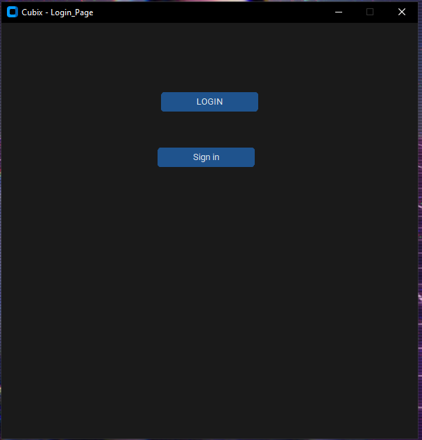
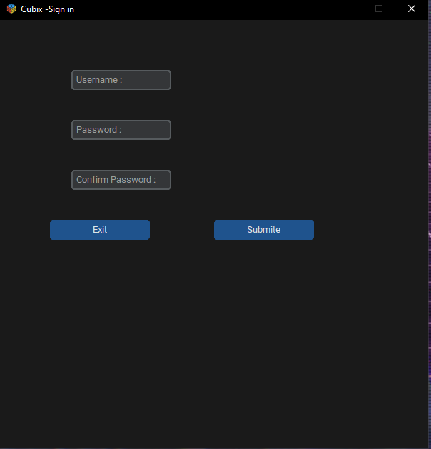
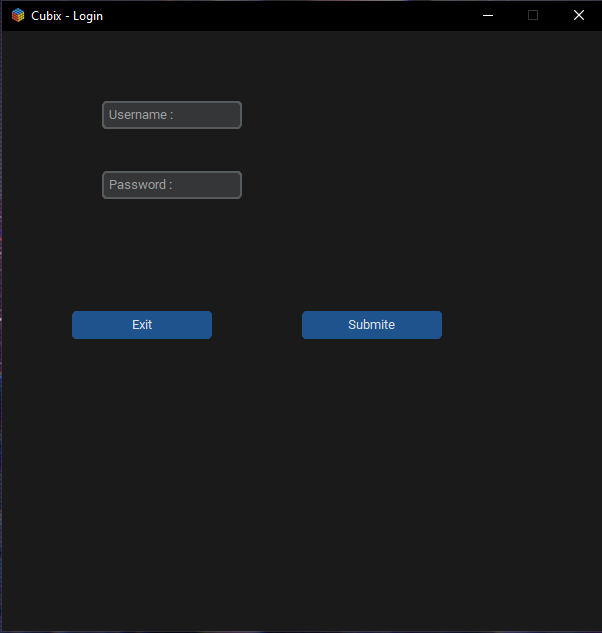

# login_python_gui

Description: The code is currently under development and will be completed soon.

## Installation

Instructions on how to install and set up the project.
python3 -m pip install -r requirements.txt
python3 server.py
python3 client.py

## License

Specify the project's license information.

## Author

- https://github.com/ghosty0x0hero

## Screenshots

